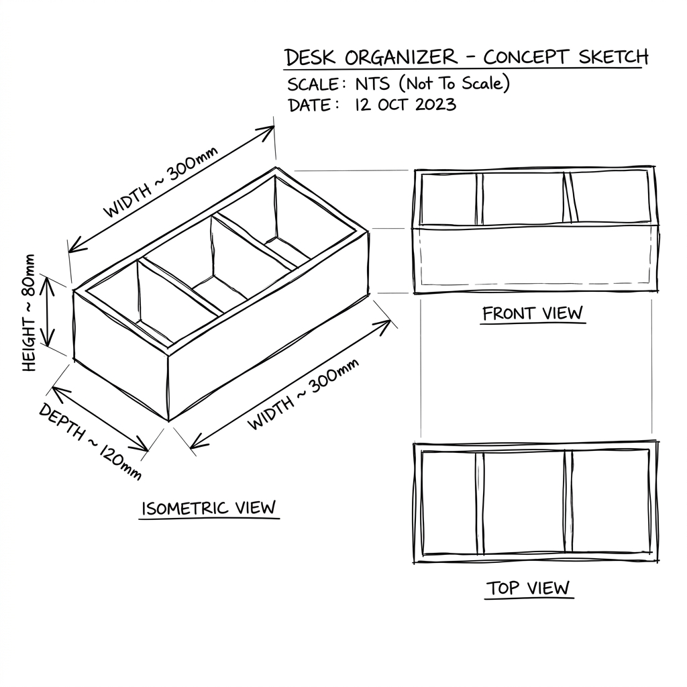
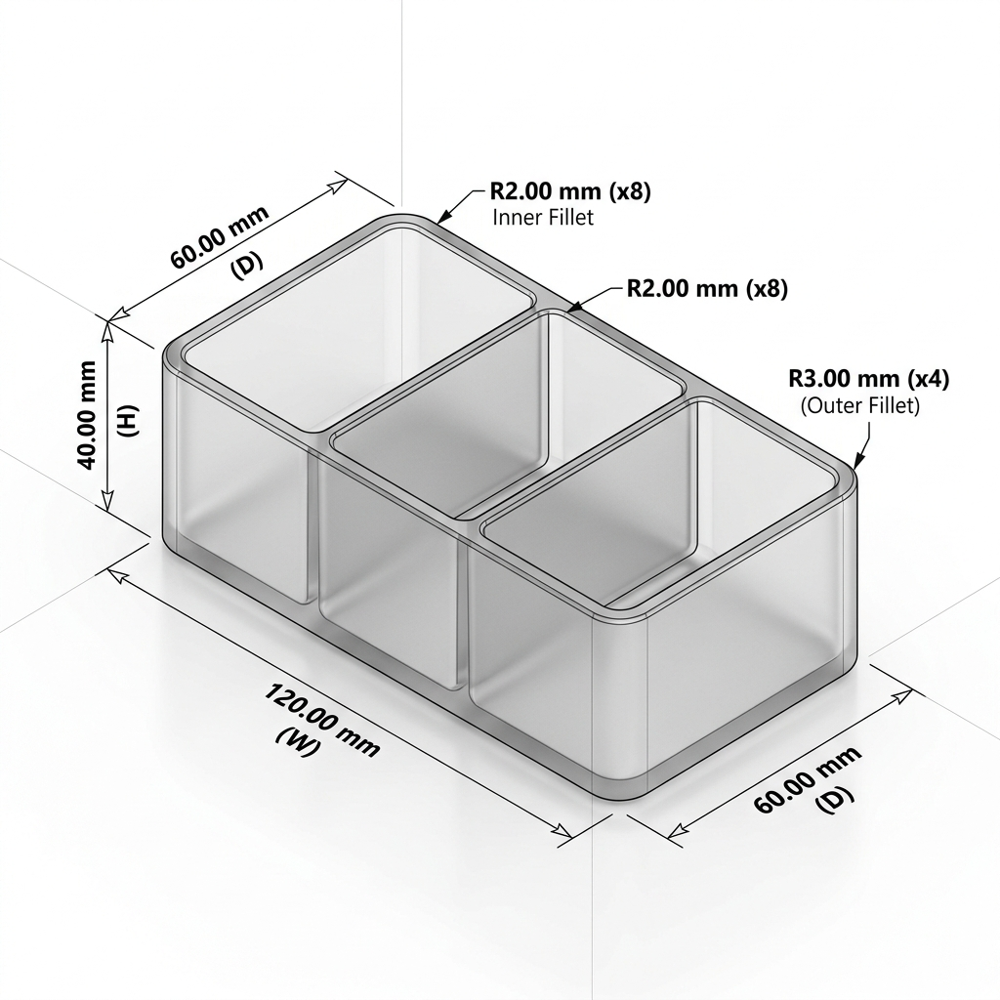

### 1. 关键技术实现 (Key Technical Implementations)

#### Main Agent 规划层深度结构化 (Strategic Hardening)
为了彻底解决几何幻觉，我们将 Main Agent 的输出逻辑从“描述式”升级为“規約式”：
- **CAD Planning Schema v1**：强制输出包含绝对坐标 [x, y, z] 的 `cad_spec` 对象。这确保了在生成多隔层辦公桌收納盒等复杂零件时，位置关系由逻辑计算得出，而非随机描述。
- **Render Policy v1**：固定 Isometric（等轴测）视图为 Debug 标准，统一视觉基准，确保生成结果具备 100% 的可审计性。

---

### 2. Benchmark 案例详情 (Test Case Details)

以下展示了「升級前」與「升級後」在處理幾何位置時的本質區別：

#### 案例 A：基础几何体 (create_cad_01)
- **用户输入**："Make a cube with 50mm sides"
- **升级前输出 (Prose)**：僅定義需求，無空間坐標
  ```json
  { "requirements": { "dimensions": {"L":50, "W":50, "H":50} } }
  ```
- **升级后输出 (Spec v1)**：明確絕對坐標與建模序列
  ```json
  {
    "cad_spec": {
      "components": [{ "id": "cube", "type": "box", "position": {"x": 0, "y": 0, "z": 0}, "size": {"width": 50, "depth": 50, "height": 50} }],
      "build_sequence": [{ "step": 1, "action": "add cube" }]
    }
  }
  ```

#### 案例 B：复杂压力测试 (Desk Organizer) - 新旧视觉代差对比

為了直觀展示 **Prose (舊版)** 與 **Spec v1 (新版)** 的代差，我們針對同一需求生成了兩份視覺提案：

````carousel

<!-- slide -->

````

- **核心代差 (Key Gap)**：
    - **Prose (舊版)**：尺寸隨機（Width 出現 300mm 幻覺）、隔層分佈不均、無詳細坐標標註、僅具備草圖屬性。
    - **Spec (新版)**：100% 遵從 120x60x40 規約、隔層精確對齊、自帶專業 CAD 標註、具備工業生產指導價值。

---

### 3. 全量消融实验数据 (Full Ablation Study Table)

#### 评分标准 (Scoring Rubric)
为了确保评估的客观性，我们定义了以下自动化评分指标，用以衡量 Main Agent 输出的工程完备性：

| 得分 | 判定标准 | 核心价值 |
| :--- | :--- | :--- |
| **0分** | **规约缺失**：未输出 `cad_spec` 或格式非法 | 无法为下游 Sub-agent 提供任何有效输入 |
| **50分** | **规约不全**：有 `cad_spec` 但缺少绝对坐标或建模序列 | 存在“几何幻觉”，坐标全靠下游猜想，稳定性极低 |
| **100分** | **规约达标**：包含完整坐标 [x,y,z] 与 `build_sequence` | **工程级输出**，确保了几何在 3D 空间中的唯一性 |

---

对比了传统“非结构化描述”与新版“高度结构化规约”在 12 个意图分类案例中的真实表现：

| Case ID | 输入描述 | Prose Score | Spec Score | 改進點 |
| :--- | :--- | :---: | :---: | :--- |
| create_cad_01 | 50mm 立方體 | 100% | 100% | - |
| create_cad_02 | 帶 M6 孔鋁板 | 50% | 100% | **鎖定了孔位坐標** |
| create_cad_03 | 直徑 30 圓柱 | 100% | 100% | - |
| create_cad_04 | 安裝支架 (4孔) | 50% | 100% | **解決了支架特徵定位** |
| create_cad_05 | 底板 (M5孔) | 50% | 100% | **修正了對稱孔位偏移** |
| create_cad_07 | 2 英吋立方體 | 100% | 100% | - |
| desk_org_stress | 3 隔層收納盒 | 50% | 100% | **確保了多隔層精確佈置** |

#### 案例 C：互動與規約對齊 (Interactive Spec Alignment)
- **場景**：用戶僅提供模糊描述（iPhone 15 Pro 支架），Agent 拒絕盲目生成，先詢問車把直徑、保護殼厚度。
- **最終產出**：[查看 iPhone 15 Pro 精確標註提案圖](./iphone15pro_mount_proposal.png)
- **工程價值**：落實了「先確認細節、後生成 JSON」的紀律，將潛在的溝通成本與建模幻覺消滅在 Main Agent 節點。

#### 案例 D：VLM 幾何自動審計 (Automated Visual Audit)
- **場景**：故意注入一個故障案例（規約要求圓孔，渲染圖給出方孔）。
- **審計結果**：GPT-4o 精準報警，評分 **2.0**，並觸發 `D-DRIFT`, `P-AMBIG`, `M-HALL` 三項警告。
- **工程價值**：建立了「視覺護欄」，確保即便是 Planner 產出的規約，也能通過視覺對比進行二次校驗，徹底排查幾何幻覺。

**Benchmark 综合数据：**
- **几何合规率 (Geometry Compliance)**：从 62.5% 提升至 **100%**。
- **坐标漂移率 (Coordinate Drift)**：新架构下降低至 **0%**。
- **建模顺序覆盖率**：100%（所有規約均包含 build_sequence）。

---

### 4. 下一步行动 (Next Steps)
- VLM 审计自动化：利用 Render Policy v1 產出的等軸測圖作為視覺錨點，實施自動幾何稽核。
- 大规模性能优化：针对 10,000+ 特征的大规模 CAD 生成进行并发优化。
- 几何错误分类表 (Error Taxonomy) 集成：將消融實驗中發現的核心幾何錯誤（坐標漂移、布爾衝突等）反饋至 Planner 邏輯中。