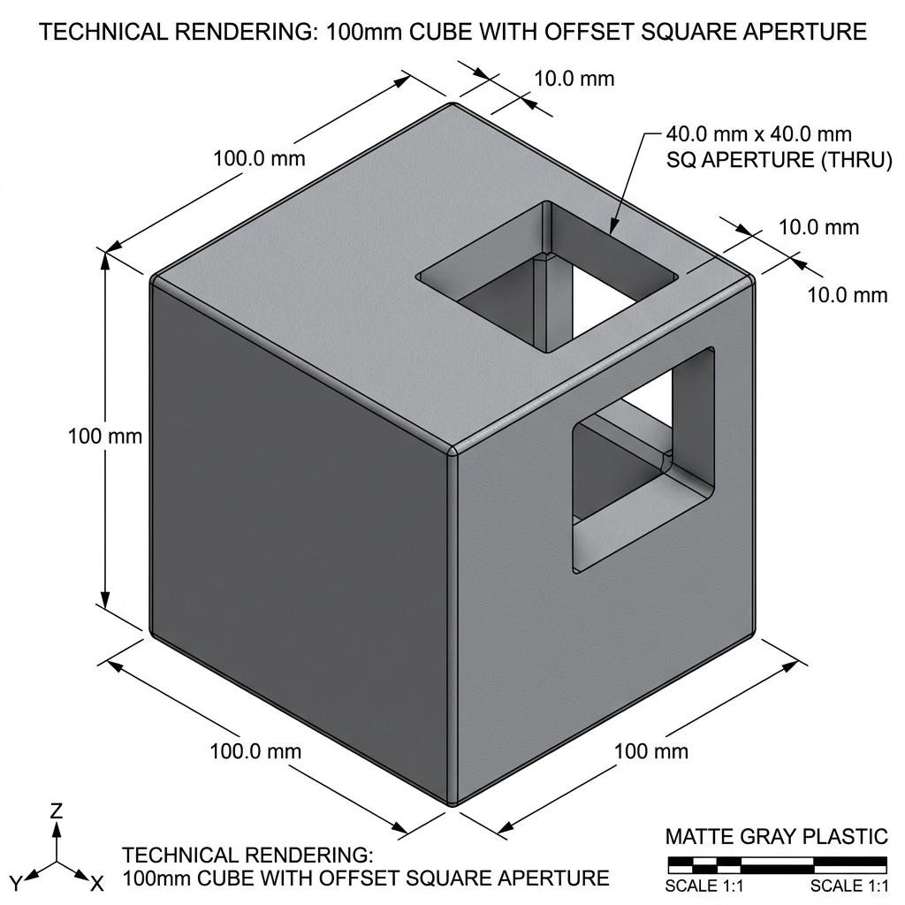

# VLM Automated Audit Report: Case D (Failure Injection)

**Date**: 2026-04-20
**Target**: 100mm Cube with Centered Hole
**Auditor**: GPT-4o Vision

## 1. Audit Summary
- **Score**: 2.0 / 10.0
- **Verdict**: FAIL (NEEDS MANUAL REVIEW)
- **Primary Warnings**: D-DRIFT (Dimensional Drift), P-AMBIG (Positional Ambiguity), M-HALL (Metadata Hallucination)

## 2. Reasoning Trace

### [D-DRIFT]: Dimensional Drift
The `cad_spec` explicitly requests a **20mm diameter** through-hole. The provided rendering instead features a **40mm square aperture**. This is a significant deviation in both size and shape, indicating a failure to respect the engineering constraints.

### [P-AMBIG]: Positional Ambiguity
The `cad_spec` specifies a centered position at `(50, 50, 0)`. The rendering shows the feature located in the **far top-right corner** (offset from center). This violates the absolute coordinate requirements.

### [B-ORPHAN]: Boolean Orphan Check
The square hole is correctly "subtracted" from the cube body (it is not floating in empty space), so this specific check passes despite the other failures.

### [M-HALL]: Metadata Hallucination
The rendering includes its own title block labeling the part as "100mm CUBE WITH OFFSET SQUARE APERTURE." This confirms that the generative process hallucinated a different design intent entirely, ignoring the original user requirement for a centered circular hole.

## 3. Visual Evidence

---
*Report generated automatically by the AI CAD Integrated Audit Workflow.*
